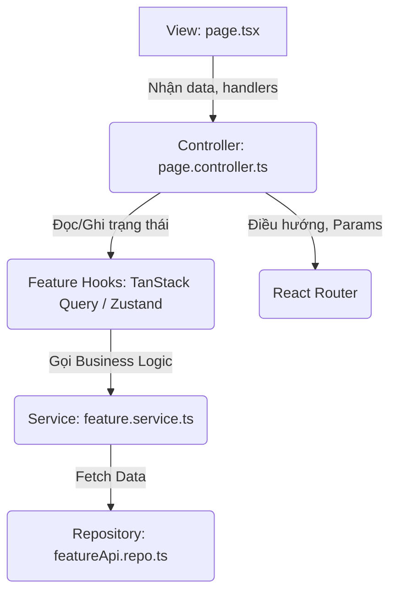

# Kiến trúc tổng thể (Architecture Overview)

Dự án này sử dụng kiến trúc kết hợp giữa **Feature-Sliced Design (FSD)** và mô hình **MVC Hooks Pattern** trong React.
Mục tiêu là tách biệt hoàn toàn UI (View), State/Side-effects (Store), UI Logic (Controller), và Business Logic (Service/Repository).

## Cấu trúc thư mục (Folder Structure)

```text
src/
├── apps/               # Các ứng dụng/module chính (admin, auth, client)
│   ├── [app_name]/
│   │   ├── components/ # Các UI components dùng chung trong app này
│   │   ├── features/   # Các domain/feature chứa logic nghiệp vụ
│   │   ├── layout/     # Layout bọc ngoài các trang của app
│   │   ├── pages/      # Các trang (Views) và logic giao diện
│   │   └── routes/     # Định tuyến riêng của app
├── assets/             # Hình ảnh, icons, fonts toàn hệ thống
├── components/         # Các UI components dùng chung toàn hệ thống
├── core/               # Cấu hình lõi (api, auth guard, config, interceptors, constants)
├── models/             # Các Types/Interfaces dùng chung toàn hệ thống
├── routes/             # Cấu hình định tuyến gốc
└── utils/              # Các hàm tiện ích dùng chung
```

## Các thành phần trong một Feature

Mỗi feature (nằm trong `src/apps/[app]/features/[feature]`) thường bao gồm:
* `dto/`: Data Transfer Objects (Payload cho request/response).
* `model/`: Các interface/type định nghĩa dữ liệu domain.
* `repo/`: Các Repository interfaces và implementations (giao tiếp với API hoặc Mock).
* `services/`: Lớp chứa business logic (Class-based), gọi các repo.
* `hooks/`, `context/`, `utils/`: Tùy chọn nếu feature cần.

## Mô hình luồng dữ liệu của trang (Page Data Flow)

Một trang (Page) thường được cấu trúc thành 3 lớp chính, phân chia rõ trách nhiệm:



1. **View (`[page].tsx`)**:
   - Chỉ chịu trách nhiệm hiển thị (JSX/HTML/CSS).
   - Gọi custom hook `use[Page]Controller()` để lấy dữ liệu và các hàm xử lý sự kiện (handlers).
   - Không chứa logic nghiệp vụ, hạn chế tối đa logic giao diện phức tạp.

2. **Controller (`[page].controller.ts`)**:
   - Quản lý logic giao diện người dùng (UI Logic).
   - Đọc URL parameters, query strings.
   - Định tuyến (navigation).
   - Gọi custom hook `use[Page]Store()` để tương tác với state.
   - Trả về dữ liệu và hàm cho View sử dụng.

3. **Feature Hooks (TanStack Query / Zustand)**:
   - Quản lý Server State bằng TanStack Query (`useQuery`, `useMutation`).
   - Quản lý Global Client State (nếu có) bằng Zustand (`useToastStore`, `useAuthStore`).
   - Xử lý các side-effects và Cache Invalidation.
   - Gọi trực tiếp đến các Services.

4. **Service (`[feature].service.ts`)**:
   - Cung cấp các hàm business logic. Chuyển đổi dữ liệu từ Repo thành Model phù hợp.
   - Thường được viết dưới dạng OOP Class và được export thành một singleton (e.g., `export const productService = new ProductService()`).

5. **Repository (`[feature].repo.ts`)**:
   - Cung cấp các methods để tương tác với data source (API/Mock).
   - Bắt buộc phải có một abstract/interface/base repo và các implementations cụ thể (`[Feature]ApiRepo`, `[Feature]MockRepo`) để dễ dàng chuyển đổi qua lại giữa Mock và API thật dựa trên `USE_MOCK` config.

## Dependency Direction (Hướng phụ thuộc)
* **View** phụ thuộc vào **Controller**.
* **Controller** phụ thuộc vào **Feature Hooks**, **Router**, và **DTO/Models**.
* **Feature Hooks** phụ thuộc vào **Service**, và **Models**.
* **Service** phụ thuộc vào **Repository**.
* **Repository** phụ thuộc vào **Core API Client** (`axios.ts`).
* Chiều ngược lại bị nghiêm cấm (Ví dụ: Service không được import Controller, Controller không được thao tác trực tiếp với DOM).
